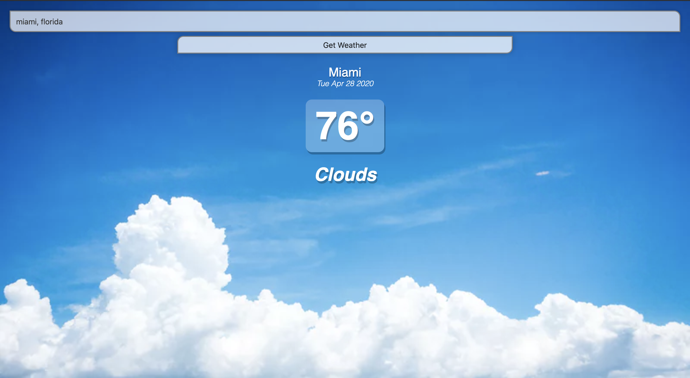

### Weather Application

Users can enter a city and state and get the current weather info; which is then displayed on the screen. The background picture changes depending upon the temperature of the city. This was written using Vue. 

### New York, New York

### Miami, Florida

### Let's connect 
[LinkedIn](https://www.linkedin.com/in/jamal-numan/)
